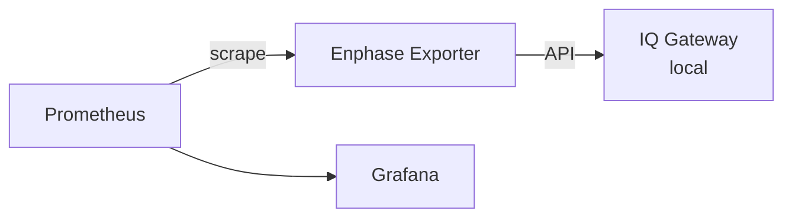

# Enphase Prometheus Exporter

A Prometheus exporter for Enphase IQ Gateway that exposes solar production metrics from your local gateway.

## Features

- **Local API access** - No cloud dependency, real-time metrics
- **Per-inverter metrics** - Monitor individual panel performance
- **Production & consumption** - Track solar production and home consumption
- **Net power** - See if you're exporting or importing from the grid
- **Meter readings** - Voltage, current, power factor, frequency per phase
- **Daily/weekly totals** - Production and consumption trends
- **Kubernetes ready** - Includes Deployment, Service, and ServiceMonitor manifests

## Metrics

### Production Metrics

| Metric | Description | Labels |
|--------|-------------|--------|
| `enphase_production_watts` | Current production in watts | `device_type` |
| `enphase_production_wh_total` | Lifetime production in Wh | `device_type` |
| `enphase_production_wh_today` | Production today in Wh | `device_type` |
| `enphase_production_wh_last_seven_days` | Production last 7 days in Wh | `device_type` |
| `enphase_production_voltage_volts` | RMS voltage | `device_type` |
| `enphase_production_current_amps` | RMS current | `device_type` |
| `enphase_production_power_factor` | Power factor | `device_type` |

### Consumption Metrics

Requires consumption CT clamps installed at your main panel.

| Metric | Description | Labels |
|--------|-------------|--------|
| `enphase_consumption_watts` | Current consumption in watts | `measurement_type` |
| `enphase_consumption_wh_total` | Lifetime consumption in Wh | `measurement_type` |
| `enphase_consumption_wh_today` | Consumption today in Wh | `measurement_type` |
| `enphase_consumption_wh_last_seven_days` | Consumption last 7 days in Wh | `measurement_type` |

The `measurement_type` label distinguishes:
- `total-consumption` - Total power consumed by your home
- `net-consumption` - Consumption from the grid (excludes self-consumed solar)

### Net Power

| Metric | Description | Labels |
|--------|-------------|--------|
| `enphase_net_watts` | Net power (production - consumption). Positive = exporting, negative = importing | - |

### Per-Inverter Metrics

| Metric | Description | Labels |
|--------|-------------|--------|
| `enphase_inverter_watts` | Per-inverter current production | `serial_number` |
| `enphase_inverter_max_watts` | Per-inverter max reported | `serial_number` |
| `enphase_inverter_last_report_timestamp` | Unix timestamp of last report | `serial_number` |

### Meter Metrics

| Metric | Description | Labels |
|--------|-------------|--------|
| `enphase_active_power_watts` | Meter active power | `meter_id`, `phase` |
| `enphase_current_amps` | Meter current | `meter_id`, `phase` |
| `enphase_voltage_volts` | Meter voltage | `meter_id`, `phase` |
| `enphase_power_factor` | Meter power factor | `meter_id`, `phase` |
| `enphase_frequency_hz` | Grid frequency | `meter_id` |
| `enphase_energy_exported_wh` | Cumulative energy exported to grid in Wh | `meter_id`, `phase` |
| `enphase_energy_imported_wh` | Cumulative energy imported from grid in Wh | `meter_id`, `phase` |

The `phase` label can be `total` for aggregate values or `L1`, `L2`, etc. for per-phase readings.

### Exporter Metrics

| Metric | Description | Labels |
|--------|-------------|--------|
| `enphase_exporter_build_info` | Build information | `version`, `commit`, `built` |

## Quick Start

### 1. Generate JWT Token

Go to [entrez.enphaseenergy.com](https://entrez.enphaseenergy.com):

1. Log in with your Enlighten credentials
2. Search for your system by name
3. Select your gateway from the dropdown
4. Click "Create access token"
5. Copy the token (valid for 1 year)

### 2. Configure

```bash
cp .env.example .env
```

Edit `.env`:

```bash
ENVOY_ADDRESS=https://envoy.local   # Or use IP: https://192.168.x.x
ENVOY_SERIAL=your-gateway-serial
ENVOY_JWT=your-jwt-token
```

### 3. Run

**Local:**
```bash
go run ./cmd/exporter
```

**Docker:**
```bash
docker build -t enphase-exporter .
docker run -p 9090:9090 --env-file .env enphase-exporter
```

**Docker Compose:**
```bash
docker-compose up
```

### 4. Verify

```bash
curl http://localhost:9090/metrics | grep enphase_
```

## Docker Deployment

### Option 1: Docker Run

```bash
# Build the image
docker build -t enphase-exporter .

# Run with environment variables
docker run -d \
  --name enphase-exporter \
  --restart unless-stopped \
  -p 9090:9090 \
  -e ENVOY_ADDRESS=https://192.168.1.100 \
  -e ENVOY_SERIAL=your-serial \
  -e ENVOY_JWT=your-jwt-token \
  enphase-exporter
```

### Option 2: Docker Compose

Create a `docker-compose.yml`:

```yaml
version: '3.8'
services:
  enphase-exporter:
    build: .
    # Or use: image: ghcr.io/rhwendt/enphase-exporter:latest
    container_name: enphase-exporter
    restart: unless-stopped
    ports:
      - "9090:9090"
    environment:
      - ENVOY_ADDRESS=https://192.168.1.100
      - ENVOY_SERIAL=your-serial
      - ENVOY_JWT=your-jwt-token
      - LOG_LEVEL=info

  # Optional: Add Prometheus to scrape the exporter
  prometheus:
    image: prom/prometheus:latest
    container_name: prometheus
    restart: unless-stopped
    ports:
      - "9091:9090"
    volumes:
      - ./deploy/prometheus.yaml:/etc/prometheus/prometheus.yml
      - prometheus_data:/prometheus
    command:
      - '--config.file=/etc/prometheus/prometheus.yml'
      - '--storage.tsdb.path=/prometheus'

volumes:
  prometheus_data:
```

Run:
```bash
docker-compose up -d
```

### Option 3: Using .env file

```bash
# Create .env from example
cp .env.example .env
# Edit .env with your values

# Run with .env file
docker run -d \
  --name enphase-exporter \
  --restart unless-stopped \
  --env-file .env \
  -p 9090:9090 \
  enphase-exporter
```

### Health Checks

The container exposes health endpoints:
- `/health` - Liveness (is the process running?)
- `/ready` - Readiness (is it authenticated and working?)

```bash
# Check if running
curl http://localhost:9090/health

# Check if authenticated
curl http://localhost:9090/ready
```

## Kubernetes Deployment

```bash
# Create secret with your credentials
kubectl create secret generic enphase-exporter \
  --from-literal=serial=your-serial \
  --from-literal=jwt=your-jwt-token

# Deploy
kubectl apply -f deploy/kubernetes/
```

The ServiceMonitor will automatically configure Prometheus Operator to scrape metrics.

## Configuration

| Variable | Required | Default | Description |
|----------|----------|---------|-------------|
| `ENVOY_ADDRESS` | Yes | - | Gateway URL (e.g., `https://envoy.local`) |
| `ENVOY_SERIAL` | Yes | - | Gateway serial number |
| `ENVOY_JWT` | Yes | - | JWT token from entrez.enphaseenergy.com |
| `EXPORTER_PORT` | No | `9090` | Metrics endpoint port |
| `LOG_LEVEL` | No | `info` | Log level (debug, info, warn, error) |
| `LOG_FORMAT` | No | `text` | Log format (text, json) |

## Endpoints

| Path | Description |
|------|-------------|
| `/metrics` | Prometheus metrics |
| `/health` | Liveness probe (always returns 200) |
| `/ready` | Readiness probe (200 when authenticated) |

## Architecture



## Authentication Flow

```
1. User generates JWT at entrez.enphaseenergy.com (1 year validity)
2. Exporter validates JWT with gateway (/auth/check_jwt)
3. Gateway returns session cookie (30 min validity)
4. Exporter auto-refreshes session before expiry
5. API requests use session cookie
```

## Development

```bash
# Build
go build -o enphase-exporter ./cmd/exporter

# Build with version info
go build -ldflags "-X main.Version=1.0.0 -X main.GitCommit=$(git rev-parse HEAD)" ./cmd/exporter

# Run tests
go test ./...

# Lint
golangci-lint run
```

## License

MIT

## Acknowledgments

- [Enphase-API](https://github.com/Matthew1471/Enphase-API) - API documentation
- [go-envoy](https://github.com/loafoe/go-envoy) - Reference implementation
